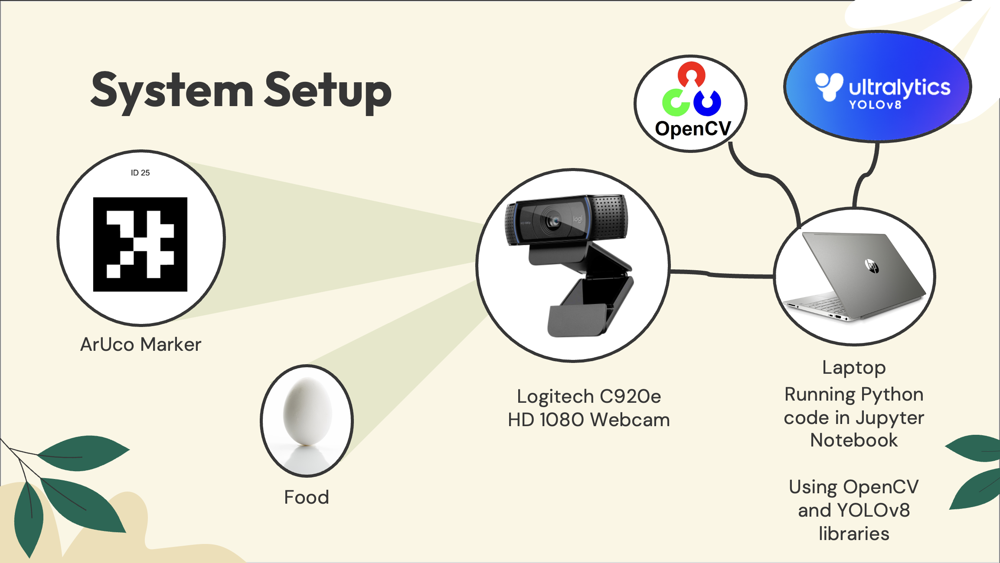

# AR-food-scanner
## Introduction
_Scanwich_ is an augmented reality (AR) nutrition tracking system made to calorie-track common household foods. The purpose of this application is to help users choose ingredients that meet their dietary needs while making a meal. The discrete ingredients will be scanned using a webcam, and the scanned items and their total nutrition facts will be overlayed on an ArUco marker. The different food options that can be detected by Scanwich were trained using datasets found on Roboflow. Currently, Scanwich is capable of detecting common breakfast foods and is a good prototype of a calorie-tracking system that can be easily expanded into a more robust application in the future

## Design 
Scanwich’s programming was done in Python using Jupyter Notebook. The implementation consists of three main components: object detection, nutrition information, and the augmented reality overlay. 

For each breakfast food option that the system can detect, a pre-made open-source dataset was found and downloaded from Roboflow, a platform to create and deploy computer vision models. Each ingredient’s dataset consisted of 100-300 trained and annotated images of the desired object, which was compiled into a dataset file. YOLOv8, a set of deep learning-based object detection algorithms, was used to train the downloaded dataset. The trained model outputs a .pt file, which is used in Scanwich’s food detection system on Jupyter Notebook to detect, draw bounding boxes, and provide a confidence score of the food. 

Based on what food item is scanned, the nutrition facts are retrieved from a set of predefined arrays in the Python code. By pressing the space bar on the computer’s keyboard that the system is running on, the scanned object’s label is recorded and compared with an array of the trained food items. When a match is found, the array element number is used to retrieve the nutrition information of the food from each nutrient’s array. If there are multiple food items scanned, the nutrition information will be tallied up to display a final result of the combined calories and nutrition facts on the AR overlay. The user can reset the final output and food count as well.

The camera detects ArUco markers using the ArUco library. An ArUco marker has a black border and a distinct matrix of black and white pixels. This implementation uses the 5x5 marker, specifically marker ID #25, but Scanwich can detect any 5x5 ArUco marker. Using OpenCV and ArUco’s built-in functions, we can determine the coordinates of the ArUco marker’s corners. These corners become the destination points for the AR overlay canvas. An image is created to overlay on the ArUco marker, called the “canvas”. The canvas consists of the Scanwich logo and a blank nutrition facts label. Text is written onto the nutrition facts label according to the “seen” foods. 

## Results
Currently, the system can identify apples, bananas, potatoes, eggs, bread, and cereal. When the application opens, the camera launches, and the webcam’s footage is displayed on the computer monitor. Visually, when an object is identified, a bounding box appears around the object with the name of the identified object above the box along with a confidence score indicating how confident the trained model is in identifying the object. In the code, there is a different trained model for each identifiable object, and the program switches between each included model to check if the webcam video has detected any of the trained food in the frame. A threshold is placed on the confidence score of each food item to avoid a food item being wrongly detected to be another food item with lower confidence. The lower the threshold, the easier it is to detect an object; the higher the threshold, the harder it is to register a detection.

To record the different objects in the frame, the space bar is pressed by the user. This adds the scanned food object to a running list of scanned or “seen” foods. The calories and other nutritional information are retrieved for each food item and tallied up for the final nutritional value. Those values are overlaid on the ArUco marker on a nutritional facts label, along with the list of scanned foods. To clear out the selected foods, press "G".

## Conclusion
_Scanwich_ serves as a comprehensive prototype of a calorie-tracking application using machine vision and deep learning. The object detection was trained for multiple foods, and the nutritional value was successfully calculated in code and displayed using AR. 

This system can be improved in a few ways to improve the user experience. The frame rate of the camera output is very slow from high amounts of computation occurring in each frame. By training one dataset to identify all the desired food items, the program doesn’t need to switch between multiple models between each frame. Accuracy can be improved by adding more images to the dataset or adjusting training parameters such as the number of epochs, the batch size, and letting the models train longer. Scanwich is better suited for a user-friendly mobile application rather than Jupyter Notebook and a webcam. Currently, the system can detect six food items. More foods should be trained in the future.
